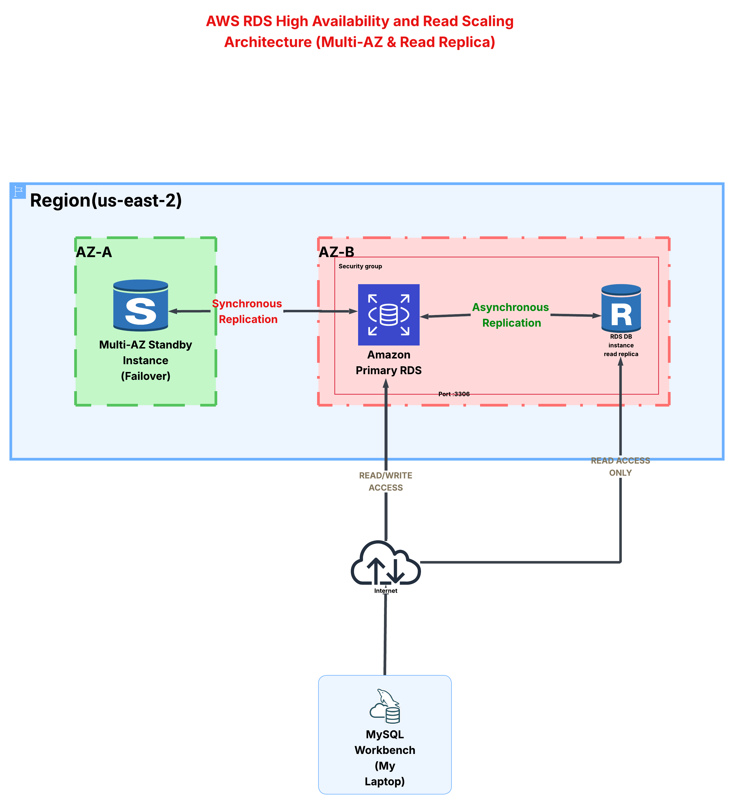

# AWS RDS MySQL High Availability & Read Scaling Lab
## Multi-AZ Deployment and Read Replica Implementation



## Overview

This project demonstrates Amazon RDS for MySQL with:

- Multi-AZ Deployment for high availability and automatic failover.
- Read Replica for improving read scalability and distributing read workloads.

## Architecture

The solution contains:

- Amazon RDS MySQL Primary Instance
- Multi-AZ Standby Instance
- Read Replica Instance
- MySQL Workbench as a local database client

### Multi-AZ

Multi-AZ uses synchronous replication between the primary database and a standby instance in another Availability Zone.

Benefits:
- High Availability
- Automatic failover
- Data durability

The standby instance is not used for read traffic.

### Read Replica

Read Replica uses asynchronous replication from the primary database.

Benefits:
- Read workload scaling
- Reduced load on the primary instance
- Separate read-only endpoint

## Technologies Used

| Technology | Purpose |
|---|---|
| Amazon RDS MySQL | Managed relational database |
| Multi-AZ | High availability and failover |
| Read Replica | Read scaling |
| MySQL Workbench | Database connectivity |
| Security Groups | Network access control |

## Implementation Steps

### 1. Created RDS MySQL Database

Configured an Amazon RDS MySQL instance with:

- Multi-AZ deployment enabled
- Public accessibility for testing
- Security Group allowing MySQL traffic on port 3306

### 2. Connected Using MySQL Workbench

Connected from a local machine using the RDS endpoint:

- Engine: MySQL
- Port: 3306
- Username: admin

Successfully tested database connectivity.

### 3. Created Sample Database

Created a sample database and tables, then inserted test data to validate replication.

### 4. Tested Multi-AZ Failover

Performed:

```
RDS → Actions → Reboot → Reboot with Failover
```

The test verified that:

- AWS promoted the standby instance automatically.
- The RDS endpoint remained unchanged.
- Database availability was maintained.

### 5. Tested Read Replica Replication

Inserted data into the Primary RDS instance and verified that the data appeared on the Read Replica after asynchronous replication.

## Multi-AZ vs Read Replica

| Feature | Multi-AZ | Read Replica |
|---|---|---|
| Main Purpose | High Availability | Read Scaling |
| Replication Type | Synchronous | Asynchronous |
| Traffic Type | Failover only | Read Traffic |
| Read Access | No | Yes |
| Automatic Failover | Yes | No |
| Location | Different AZ | Same or Different Region |

## Project Structure

```
aws-rds-multi-az-read-replica-lab
│
├── README.md
│
└── images
    ├── architecture.png
    ├── multi-az-enabled.png
    ├── read-replica.png
    └── replication-test.png
```

## Key Learnings

- Deploying Amazon RDS MySQL databases.
- Understanding Multi-AZ high availability.
- Understanding Read Replica scaling.
- Testing database failover.
- Working with synchronous and asynchronous replication.

## Author

Shahd Ahmed  
Cloud & DevOps Engineer | AWS
